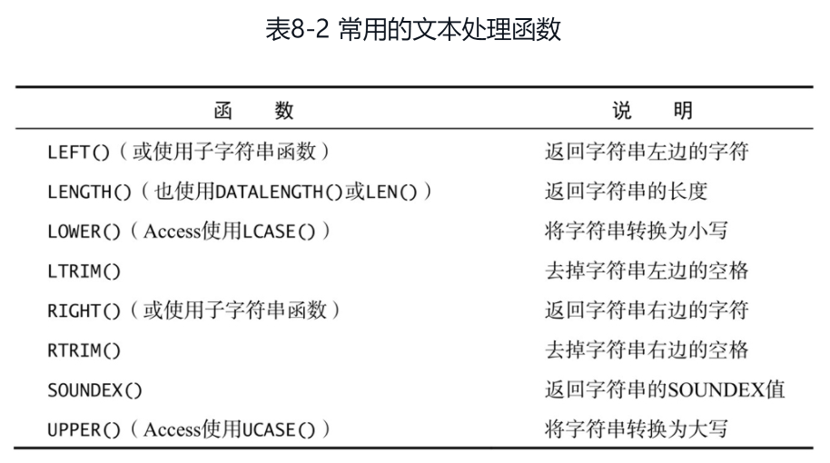
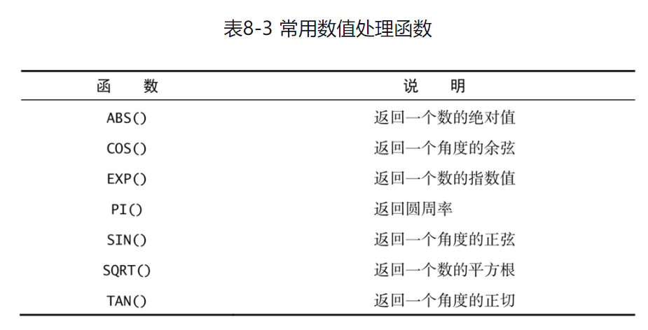
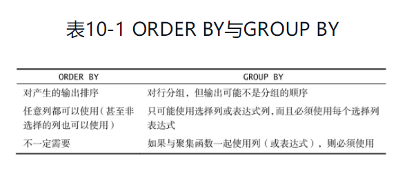
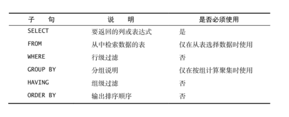

[TOC]

# SQL总结

### 选择数据

- select from
- select * from 
- 注意尽量少用通配符，使用*会先在字典中查找表中所有的列，降低性能

### 排序

- order by 
- order by desc （默认asc）
- order by 应该在where子句之后

### 过滤数据

- where condition
- 常见的条件判断
  - < > = !=
  - BETWEEN AND 包括边界
  - IS NULL 
  - 未知（unknown）有特殊的含义，数据库不知道它们是否匹配，所以在进行匹配过滤或非匹配过滤时，不会返回对应值为NULL的结果

### 高级数据过滤

- **组合where子句**
  - AND OR 操作符
  - where condition1 AND condition2 AND condition3
  - where condition1 OR condition2
  - 注意在SQL中AND运算符优先级高于OR，为确保正确逻辑请常用()
- **IN操作符**
  - IN 的作用与OR相当
  - IN操作符一般比一组OR操作符执行得更快
  - IN的最大优点是可以包含其他SELECT语句，能够更动态地建立WHERE子句

```mysql
select prod_name,prod_price
from Products
where vend_id IN ('DLL01','BSR01');
```

- **NOT操作符**

```mysql
select prod_name
from Products
where NOT vend_id='DLL01';
```

### 利用通配符过滤

- LIKE操作符

- % 通配符

  - 在搜索串中，%表示任何字符出现任意次数。例如，为了找出所有以词Fish起头的产品，可发布以下SELECT语句

  - %不会匹配NULL

  - 注意空格对匹配的影响，许多DBMS用空格填满字符串长度不足的部分

    ```mysql
    select prod_id,prod_name
    from Products
    # 'Fish%'表示搜索模式
    where prod_name LIKE 'Fish%'; 
    ```

    ```mysql
    select prod_id,prod_name
    from Products
    # %可以放在任意位置
    where prod_name LIKE '%bean bag%'; 
    ```

- _ 通配符

  - 只匹配单个字符

    ```mysql
    select prod_id,prod_name
    from Products
    where prod_name LIKE '__ inch teddy bear';# __匹配刚好两个字符
    ```

  - 不要过度使用通配符
  - 在确实需要使用通配符时，也尽量不要把它们用在搜索模式的开始处。把通配符置于开始处，搜索起来是最慢的

### 创建计算字段

- 拼接字段

  ```mysql
  select Concat(vend_name,' (',vend_country,')') # 拼接的字段、字符串用逗号分隔 Concat函数
  from Vendors;
  ```

  - 使用RTRIM()函数去除字符串右边多余的空格

    ```mysql
    select Concat(RTRIM(vend_name),' (',RTRIM(vend_country),')') # 拼接字段并去除字符串右边多余的空格
    from Vendors;
    ```

  - LTRIM() TRIM() 函数

  - 列别名（导出列）

    ```mysql
    select Concat(RTRIM(vend_name),' (',RTRIM(vend_country),')') 
    AS vend_title
    from Vendors;
    ```

  - 算数计算 + - * /

### 使用函数处理数据

- 文本处理函数

  

- 日期和时间处理函数

  ```mysql
  select order_num
  from Orders
  where YEAR(order_date)=2012;
  ```

- 数值处理函数

  

### 汇总数据

- 聚集函数

  - AVG()

    ```mysql
    select AVG(prod_price) as avg_price 
    from Products;
    ```

    - AVG忽略NULL值
    - AVG只能作用于单列

  - COUNT()

    ```mysql
    select COUNT(*) as num_cust # COUNT(*)对表中行数进行计数，不忽略NULL值
    from Customers;
    ```

    ```mysql
    select COUNT(cust_email) as num_cust # 只对cust_email列有值的行进行计数
    from Customers;
    ```

  - MAX() MIN()

    ```mysql
    select MAX(prod_price) as max_price
    from Products;
    ```

    - 虽然MAX()一般用来找出最大的数值或日期值，但许多（并非所有）DBMS允许将它用来返回任意列中的最大值，包括返回文本列中的最大值。在用于文本数据时，MAX()返回按该列排序后的最后一行。MAX()函数忽略列值为NULL的行。
    - 虽然MIN()一般用来找出最小的数值或日期值，但许多（并非所有）DBMS允许将它用来返回任意列中的最小值，包括返回文本列中的最小值。在用于文本数据时，MIN()返回该列排序后最前面的行。

  - SUM()

    ```mysql
    select SUM(item_price*quantity) as total_price
    from OrderItems;
    ```

    - SUM()函数忽略列值为NULL的行

- 聚集不同值

  - DISTINCT

    ```mysql
    select AVG(DISTINCT prod_price) as avg_price
    from Products;
    ```

    - DISTINCT 不能用于COUNT(*)

### 数据分组

- 创建分组

  ```mysql
  select vend_id,count(*) as num_products
  from Products
  GROUP BY vend_id;
  ```

  - GROUP BY子句指示DBMS分组数据，然后对每个组而不是整个结果集进行聚集
  - GROUP BY子句可以包含任意数目的列，因而可以对分组进行嵌套，更细致地进行数据分组
  - 如果在GROUP BY子句中嵌套了分组，数据将在最后指定的分组上进行汇总
  - GROUP BY子句中列出的每一列都必须是检索列或有效的表达式（但不能是聚集函数）。如果在SELECT中使用表达式，则必须在GROUP BY子句中指定相同的表达式。不能使用别名
  - 大多数SQL实现不允许GROUP BY列带有长度可变的数据类型（如文本或备注型字段）
  - 除聚集计算语句外，SELECT语句中的每一列都必须在GROUP BY子句中给出
  - 如果分组列中包含具有NULL值的行，则NULL将作为一个分组返回。如果列中有多行NULL值，它们将分为一组
  - GROUP BY子句必须出现在WHERE子句之后，ORDER BY子句之前

- 过滤分组

  ```mysql
  select cust_id,count(*) as orders
  from Orders
  GROUP BY cust_id
  HAVING COUNT(*)>=2;
  ```

  - HAVING和WHERE类似，不同点在于HAVING作用于分组，WHERE作用于行

    ```mysql
    select vend_id,count(*) as num_prods
    from Products
    where prod_price>=4
    group by vend_id
    having cound(*) >=2;
    ```

  - 若不指定group by，大多数DBMS会同等对待having和select。但使用HAVING时应该结合GROUP BY子句，而WHERE子句用于标准的行级过滤。

- 分组和排序 ORDER BY

  

  - 一般在使用GROUP BY子句时，应该也给出ORDER BY子句。这是保证数据正确排序的唯一方法。千万不要仅依赖GROUP BY排序数据。

    ```mysql
    select order_num,count(*) as items
    from OrderItems
    GROUP BY order_num
    having count(*)>=3
    ORDER BY items,order_num;
    ```

- select子句顺序

  

### 使用子查询

- 利用子查询进行过滤
  - 作为子查询的SELECT语句只能查询单个列。企图检索多个列将返回错误。

即嵌套在其它查询中的查询。

```mysql
select cust_name,cust_contact
from Customers
where cust_id IN(
    select cust_id 
    from Orders
    where order_num IN(
        select order_num
        from OrderItems
        where prod_id='RGAN01'
    )
);
```

- 作为计算字段使用子查询

  ```mysql
  select cust_name,cust_state,(
      select count(*) 
      from Orders
      where Orders.cust_id=Customer.cust_id
  ) as orders
  from Customers
  order by cust_name;
  ```

  - 如果在SELECT语句中操作多个表，就应使用完全限定列名来避免歧义。

### 联结表

join操作

- 创建联结

  ```mysql
  select vend_name,prod_name,prod_price
  from Vendors,Products
  where Vendors.vend_id=Products.vend_id;
  ```

  - 由没有联结条件的表关系返回的结果为笛卡儿积。检索出的行的数目将是第一个表中的行数乘以第二个表中的行数。
  - 有时，返回笛卡儿积的联结，也称叉联结（cross join）。

- 内联结

  - 目前为止使用的联结称为等值联结（equijoin），它基于两个表之间的相等测试。这种联结也称为内联结（inner join）。其实，可以对这种联结使用稍微不同的语法，明确指定联结的类型。下面的SELECT语句返回与前面例子完全相同的数据：

  ```mysql
  select vend_name,prod_name,prod_price
  from Vendors INNER JOIN Products
  ON Vendors.vend_id=Products.vend_id;
  ```

- 联结多个表

  ```mysql
  select prod_name,vend_name,prod_price,quantity
  from OrderItems,Products,Vendors
  where Products.vend_id=Vendors.vend_id
  AND OrderItems.prod_id=Products.prod_id
  AND order_num=20007;
  ```

  - 不要联结不必要的表。联结的表越多，性能下降越厉害。

### 创建高级联结

- 使用表别名

  ```mysql
  select cust_name,cust_contact
  from Customers as C, Orders as O, OrderItems as OI
  where C.cust_id=O.cust_id
  AND OI.order_num=O.order_num
  AND prod_id='RGAN01';
  ```

  - 表别名只在查询执行中使用。与列别名不一样，表别名不返回到客户端。

- 使用不同类型的联结

  - 自联结 self join

    ```mysql
    select c1.cust_id,c1.cust_name,c1.cust_contact
    from Customers as c1, Customers as c2
    where c1.cust_name=c2.cust_name
    and c2.cust_contact='Jim Jones';
    ```

    - 自联结通常作为外部语句，用来替代从相同表中检索数据的使用子查询语句。虽然最终的结果是相同的，但许多DBMS处理联结远比处理子查询快得多。应该试一下两种方法，以确定哪一种的性能更好。

  - 自然联结 natural join

    - 自然联结排除多次出现，使每一列只返回一次。自然联结要求你只能选择那些唯一的列，一般通过对一个表使用通配符（SELECT ＊），而对其他表的列使用明确的子集来完成。

    ```mysql
    select C.*, O.order_num, O.order_date, OI.prod_id, OI.quantity, OI.item_price
    from Customers as C, Orders as O, OrderItems as OI
    where C.cust_id=O.cust_id
    AND OI.order_num=O.order_num
    AND prod_id='RGAN01';
    ```

  - 外联结 outer join

    - 许多联结将一个表中的行与另一个表中的行相关联，但有时候需要包含没有关联行的那些行。联结包含了那些在相关表中没有关联行的行。这种联结称为外联结。在使用OUTER JOIN语法时，必须使用RIGHT或LEFT关键字指定包括其所有行的表（RIGHT指出的是OUTER JOIN右边的表，而LEFT指出的是OUTER JOIN左边的表）。

      ```mysql
      select Customers.cust_id, Orders.order_num
      from Customers 	LEFT OUTER JOIN Orders
      ON Customers.cust_id=Orders.cust_id;
      ```

  - 使用带聚集函数的联结

    ```mysql
    select Customers.cust_id,
    		count(Orders.order_num) as num_ord
    from Customers INNER JOIN Orders
    	ON Customers.cust_id=Orders.cust_id
    group by Customers.cust_id;
    ```

    ### 组合查询

    多数SQL查询只包含从一个或多个表中返回数据的单条SELECT语句。但是，SQL也允许执行多个查询（多条SELECT语句），并将结果作为一个查询结果集返回。这些组合查询通常称为并（union）或复合查询（compound query）。任何具有多个WHERE子句的SELECT语句都可以作为一个组合查询

  - 创建组合查询

    - 使用UNION

      ```mysql
      select cust_name,cust_contact,cust_email
      from Customers
      where cust_state in('IL','IN','MI')
      UNION
      select cust_name,cust_contact,cust_email
      from Customers
      where cust_name='Fun4All';
      ```

      ```mysql
      select cust_name,cust_contact,cust_email
      from Customers
      where cust_state in('IL','IN','MI') or cust_name='Fun4All'; 
      ```

      在这个简单的例子中，使用UNION可能比使用WHERE子句更为复杂。但对于较复杂的过滤条件，或者从多个表（而不是一个表）中检索数据的情形，使用UNION可能会使处理更简单

  - UNION规则

    - UNION必须由两条或两条以上的SELECT语句组成，语句之间用关键字UNION分隔
    - UNION中的每个查询必须包含相同的列、表达式或聚集函数（不过，各个列不需要以相同的次序列出）。
    - 列数据类型必须兼容：类型不必完全相同，但必须是DBMS可以隐含转换的类型（例如，不同的数值类型或不同的日期类型）。

  - 包含或消除重复的行

    UNION从查询结果集中自动去除了重复的行；换句话说，它的行为与一条SELECT语句中使用多个WHERE子句条件一样。这是UNION的默认行为，如果愿意也可以改变它。事实上，如果想返回所有的匹配行，可使用UNION ALL而不是UNION。

    ```mysql
    select cust_name,cust_contact,cust_email
    from Customers
    where cust_state in('IL','IN','MI')
    UNION ALL
    select cust_name,cust_contact,cust_email
    from Customers
    where cust_name='Fun4All';
    ```

  - 对组合查询结果排序

    SELECT语句的输出用ORDER BY子句排序。在用UNION组合查询时，只能使用一条ORDER BY子句，它必须位于最后一条SELECT语句之后。对于结果集，不存在用一种方式排序一部分，而又用另一种方式排序另一部分的情况，因此不允许使用多条ORDER BY子句。

    ```mysql
    select cust_name,cust_contact,cust_email
    from Customers
    where cust_state in('IL','IN','MI')
    UNION
    select cust_name,cust_contact,cust_email
    from Customers
    where cust_name='Fun4All'
    order by cust_name,cust_contact;
    ```

    UNION在需要组合多个表的数据时也很有用，即使是有不匹配列名的表，在这种情况下，可以将UNION与别名组合，检索一个结果集。

### 插入数据

- 插入完整的行

  ```mysql
  insert into Customers
  values('10000006','Toy Land','NY');
  ```

  存储到表中每一列的数据在VALUES子句中给出，必须给每一列提供一个值。如果某列没有值，如上面的cust_contact和cust_email列，则应该使用NULL值（假定表允许对该列指定空值）。各列必须以它们在表定义中出现的次序填充。

  **虽然这种语法很简单，但并不安全，应该尽量避免使用。上面的SQL语句高度依赖于表中列的定义次序，还依赖于其容易获得的次序信息。即使可以得到这种次序信息，也不能保证各列在下一次表结构变动后保持完全相同的次序。因此，编写依赖于特定列次序的SQL语句是很不安全的，这样做迟早会出问题。最好明确给出列名**

```mysql
insert into Customers(
    cust_id,
    cust_name,
    cust_city
)
values('10000006','Toy Land','NY');
```

不要使用没有明确给出列的INSERT语句。给出列能使SQL代码继续发挥作用，即使表结构发生了变化。不管使用哪种INSERT语法，VALUES的数目都必须正确。如果不提供列名，则必须给每个表列提供一个值；如果提供列名，则必须给列出的每个列一个值。

- 插入部分行

  ```mysql
  insert into Customers(
  	cust_id,
      cust_name,
      cust_address,
      cust_city,
      cust_state,
      cust_zip,
      cust_country
  )
  values(
  	'10000006',
      'Toy Land',
      '123 Any Street',
      'New York',
      'NY',
      '11111',
      'USA'
  );
  ```

  在本课前面的例子中，没有给cust_contact和cust_email这两列提供值。这表示没必要在INSERT语句中包含它们。因此，这里的INSERT语句省略了这两列及其对应的值。

  - 省略列
    - 该列定义为允许NULL值（无值或空值）。
    - 或在表定义中给出默认值。这表示如果不给出值，将使用默认值。

- 插入检索出的数据 insert select

  ```mysql
  insert into Customers(
  	cust_id,
      cust_name,
      cust_address,
      cust_city,
      cust_state,
      cust_zip,
      cust_country
  )
  select cust_id,
      cust_name,
      cust_address,
      cust_city,
      cust_state,
      cust_zip,
      cust_country
  from CustNew;
  ```

  这个例子使用INSERT SELECT从CustNew中将所有数据导入Customers。为简单起见，这个例子在INSERT和SELECT语句中使用了相同的列名。但是，不一定要求列名匹配。事实上，**DBMS一点儿也不关心SELECT返回的列名。它使用的是列的位置**，因此SELECT中的第一列（不管其列名）将用来填充表列中指定的第一列，第二列将用来填充表列中指定的第二列，如此等等。

  INSERT通常只插入一行。要插入多行，必须执行多个INSERT语句。INSERTSELECT是个例外，它可以用一条INSERT插入多行，不管SELECT语句返回多少行，都将被INSERT插入。

- 从一个表复制到另一个表 

  ```mysql
  create table CustCopy as
  select * from Customers;
  ```

  这条语句创建一个名为CustCopy的新表，并把Customers表的整个内容复制到新表中。
  - 任何SELECT选项和子句都可以使用，包括WHERE和GROUP BY
  - 可利用联结从多个表插入数据
  - 不管从多少个表中检索数据，数据都只能插入到一个表中

### 更新和删除数据

- 更新数据 UPDATE

  - 组成

    - 要更新的表
    - 列名和它们的新值
    - 确定更新哪些行的过滤条件

    ```mysql
    update Customers
    set cust_email='aaa@bb.com'
    	cust_contact='Sam'
    where cust_id='1000000';
    ```

    UPDATE语句中可以使用子查询，使得能用SELECT语句检索出的数据更新列数据。

- 删除数据 DELETE

  ```mysql
  delete from Customers
  where cust_id='10000000';
  ```

  如果想从表中删除所有行，不要使用DELETE。可使用TRUNCATE TABLE语句，它完成相同的工作，而速度更快

### 创建和操纵表

- 创建表CREATE TABLE

  ```mysql
  create table Products
  (
      prod_id CHAR(10) NOT NULL,
      vend_id CHAR(10) NOT NULL,
      prod_name CHAR(254) NOT NULL
  );
  ```

  在创建新的表时，指定的表名必须不存在，否则会出错。防止意外覆盖已有的表，SQL要求首先手工删除该表（请参阅后面的内容），然后再重建它，而不是简单地用创建表语句覆盖它。

- 使用NULL值

  NULL值就是没有值或缺值。允许NULL值的列也允许在插入行时不给出该列的值。不允许NULL值的列不接受没有列值的行。

  多数DBMS中NULL为默认设置，不指定NOT NULL时，就认为指定的是NULL。

- 指定默认值 DEFAULT

  ```mysql
  create table OrderItems
  (
      order_num INTEGER NOT NULL,
      quantity INTEGER NOT NULL DEFAULT 1
  );
  ```

  默认值常用于时间或时间戳列。MYSQL用户指定 DEFAULT CURRENT_DATE()

- 更新表 ALTER TABLE

  ```mysql
  # 给已有表增加列
  alter table Vendors
  add vend_phone CHAR(20);
  
  # 删除列
  alter table Vendors
  drop column vend_phone;
  ```

  - 复杂表的结构更改一般需要手动删除过程，它涉及以下步骤
    - 用新的列布局创建一个新表
    - 使用INSERT SELECT语句从旧表复制数据到新表。有必要的话，可以使用转换函数和计算字段
    - 检验包含所需数据的新表
    - 重命名旧表（如果确定，可以删除它）
    - 用旧表原来的名字重命名新表
    - 根据需要，重新创建触发器、存储过程、索引和外键

- 删除表 DROP TABLE

- 重命名表 RENAME

  

